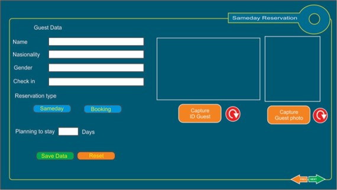
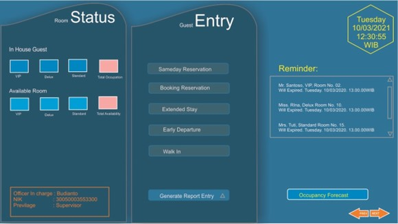
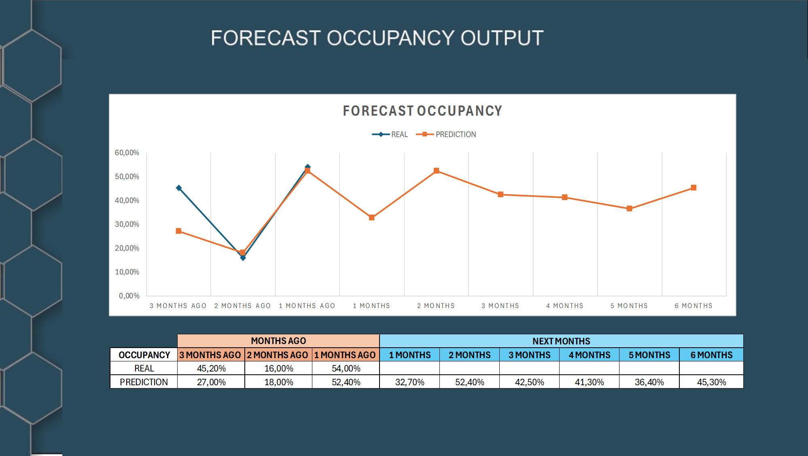

# Intelligent Decision Support System for Forecasting Occupancy Rate
Intelligent Decison Support System for Forecasting Occupancy Rate at Hotel X using Neural Network

# Introduction

The hospitality business is one of the industries that is growing in the midst of today's business competition, as evidenced by the increasing number of rooms in the accommodation business.
 
With the increasing competition in the hotel business, hotels must be able to make a good strategy in their hotel management, by knowing the factors that affect the success of hotel operations. One of the factors used to measure the operational success of a hotel is to know the occupancy rate of hotel rooms. 
 
The higher the hotel occupancy rate, the more successful the hotel business will be in generating revenue. In the hospitality business, the occupancy rate is very important to monitor and analyze as a marketing strategy and pricing policy.
 

# Forecasting Occupancy Rate at Hotel X

Based on a research titled Forecasting Occupancy Rate using Neural Network and Decision Tree at Hotel X 
 
(DOI: https://doi.org/10.37934/araset.58.1.4962)
 

 

 
 

The most optimal RMSE result for the comparison of Neural Network and Decision Tree algorithms for occupancy rate prediction at Hotel X is on the Neural Network algorithm with one hidden layer for data split 70:30 and 80:20 with an RMSE of 0.010.
 

 

 

The Intelligent Decision Support System to predict the occupancy rate at Hotel X, was created using the Neural Network method with one hidden layer on the data split of 70:30 and 80:20. The results of this Intelligent Decision Support System will greatly help hotel management in planning the provision of groceries, room needs (guest safety), and employee work schedules. Thus, hotel operations will be effective and efficient and minimize waste.

  
# User Interface

<h3>1. Guest Identity</h3>

The Room Status section provides real-time data on the number of occupied rooms (In-House Guests) and available rooms, categorized by room type (VIP, Deluxe, Standard). This feature serves as a critical tool for monitoring occupancy trends and supporting the forecasting process. The Guest Entry section lists operational options such as same-day reservations, booking reservations, extended stays, early departures, and walk-in guests. These options streamline reservation management, ensuring that data from various guest activities is centrally organized. Additionally, the Reminder section displays upcoming check-out schedules, including guest names, room numbers, and check-out times, enabling better planning and predicting future room availability. A prominent feature, the Occupancy Forecast button, highlights the core forecasting capability of the system, which leverages historical and real-time data to predict occupancy rates accurately.

<h3>2. Recapitulation of Occupancy</h3>

The Sameday Reservation form, which facilitates guest data input. The form includes fields for personal details, such as name, nationality, gender, check-in date, reservation type (same-day or booking), and the planned duration of stay. This structured data input is essential for capturing information that feeds into forecasting models. Furthermore, the form incorporates a feature for capturing guest ID and photo, ensuring accurate documentation and validation. The interface includes Save Data and Reset buttons, which streamline the process of data storage and form resetting for new entries. Navigation options are also present, indicating seamless integration with other system modules and ensuring ease of use for hotel staff.

<h3>3. Forecasting of Occupancy Rate</h3>

These images collectively demonstrate a comprehensive IDSS designed to optimize hotel operations and enhance forecasting capabilities. By integrating real-time data collection, streamlined operational management, and forecasting functionalities, the system empowers hotel managers to make data-driven decisions effectively. The combination of user-friendly interfaces and advanced predictive tools ensures that the system is not only practical but also highly relevant for improving operational efficiency and forecasting accuracy in the hospitality industry.

