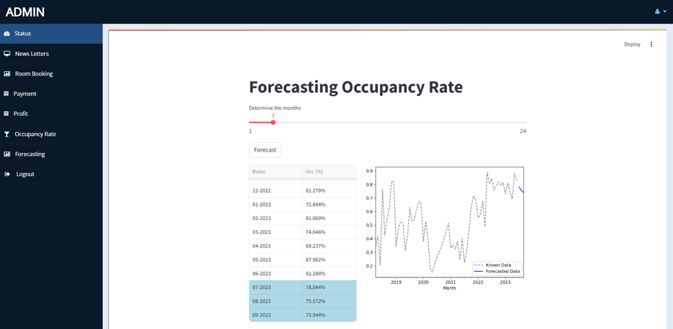

# Intelligent Decision Support System for Forecasting Occupancy Rate
Intelligent Decison Support System for Forecasting Occupancy Rate at Hotel X using Neural Network

   
  

<b>(Video Presentasi)</b>

# Introduction

The hospitality business is one of the industries that is growing in the midst of today's business competition, as evidenced by the increasing number of rooms in the accommodation business.
 
With the increasing competition in the hotel business, hotels must be able to make a good strategy in their hotel management, by knowing the factors that affect the success of hotel operations. One of the factors used to measure the operational success of a hotel is to know the occupancy rate of hotel rooms. 
 
The higher the hotel occupancy rate, the more successful the hotel business will be in generating revenue. In the hospitality business, the occupancy rate is very important to monitor and analyze as a marketing strategy and pricing policy.
 

# Forecasting Occupancy Rate at Hotel X

Based on a research titled Forecasting Occupancy Rate using Neural Network and Decision Tree at Hotel X 
 
(DOI: https://doi.org/10.37934/araset.58.1.4962)
 

 

 
 

The most optimal RMSE result for the comparison of Neural Network and Decision Tree algorithms for occupancy rate prediction at Hotel X is on the Neural Network algorithm with one hidden layer for data split 70:30 and 80:20 with an RMSE of 0.010.
 

 

 

The Intelligent Decision Support System to predict the occupancy rate at Hotel X, was created using the Neural Network method with one hidden layer on the data split of 80:20. The results of this Intelligent Decision Support System will greatly help hotel management in planning the provision of groceries, room needs (guest safety), and employee work schedules. Thus, hotel operations will be effective and efficient and minimize waste.

  
# Forecasting Model with a Neural Network (Keras)

The framework used in creating models for forecasting occupancy rate is Hard. Loud results in code that is much easier to read and concise. Hard with the API model of serialization/deserialization, callback, and data streaming using Python generators, it is very mature. The researcher also studied Keras from a book written by Basuki Rahmat and Budi Nugroho entitled "Pemrograman Deep Learning Dengan Python" (Deep Learning Programming with Python). Research can be seen at https://github.com/bsrahmat/dl

 

 

In this study, a neural network method was used with one hidden layer on an 80%:20% split data. Yields RMSE = 0.05625455303110375 and MAPE = 0.10148834250866634. The graph of the test can be seen in the following image.

 

  

  The results for the next 6 months can be seen in the following graph (detail script at file forecasting_occ_nn.ipynb)

 

 

# Web App with Streamlit

The model that has been created is then created in a web application using streamlit (forecasting_occ.py file). The web application can display forecasting occupancy rate for the next 24 months, so that the hotel will be easier in making decisions and policies in the hotel business.

 

 

# Integration with Hotel X Website (PHP-Python)

To integrate the Hotel X (PHP) website with the Streamlit application website that has been created (Python). By running Streamlit in a separate subdirectory (standalone method).  Use iframes to load the streamlit web app.
 
Example script:
 
 <iframe src="http://localhost:8501" width="100%" height="1000px"></iframe>
 
assuming the Streamlit app is running on the correct address and port (e.g.: http://localhost:8501)

 

  

