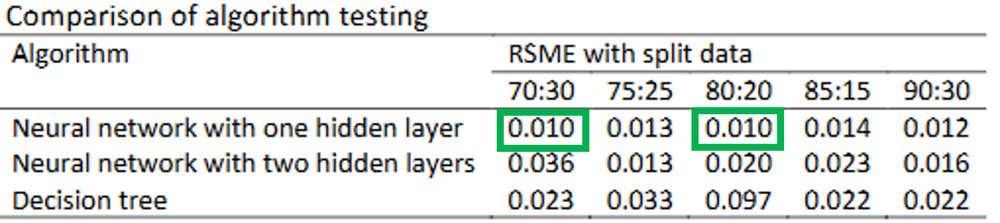

# Intelligent Decision Support System for Forecasting Occupancy Rate
Intelligent Deciison Support System for Forecasting Occupancy Rate at Hotel X using Neural Network

# Introduction

The hospitality business is one of the industries that is growing in the midst of today's business competition, as evidenced by the increasing number of rooms in the accommodation business.
 
With the increasing competition in the hotel business, hotels must be able to make a good strategy in their hotel management, by knowing the factors that affect the success of hotel operations. One of the factors used to measure the operational success of a hotel is to know the occupancy rate of hotel rooms. 
 
The higher the hotel occupancy rate, the more successful the hotel business will be in generating revenue. In the hospitality business, the occupancy rate is very important to monitor and analyze as a marketing strategy and pricing policy.
 

# Forecasting Occupancy Rate at Hotel X

Based on a research titled Forecasting Occupancy Rate using Neural Network and Decision Tree at Hotel X 
 
(DOI: https://doi.org/10.37934/araset.58.1.4962)
 

 
 
The most optimal RMSE result for the comparison of Neural Network and Decision Tree algorithms for occupancy rate prediction at Hotel X is on the Neural Network algorithm with one hidden layer for data split 70:30 and 80:20 with an RMSE of 0.010.
 

